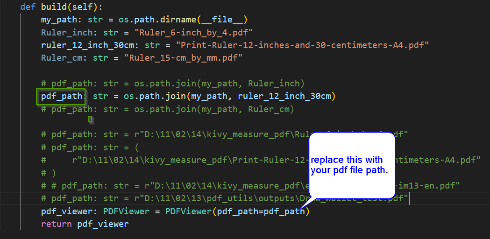
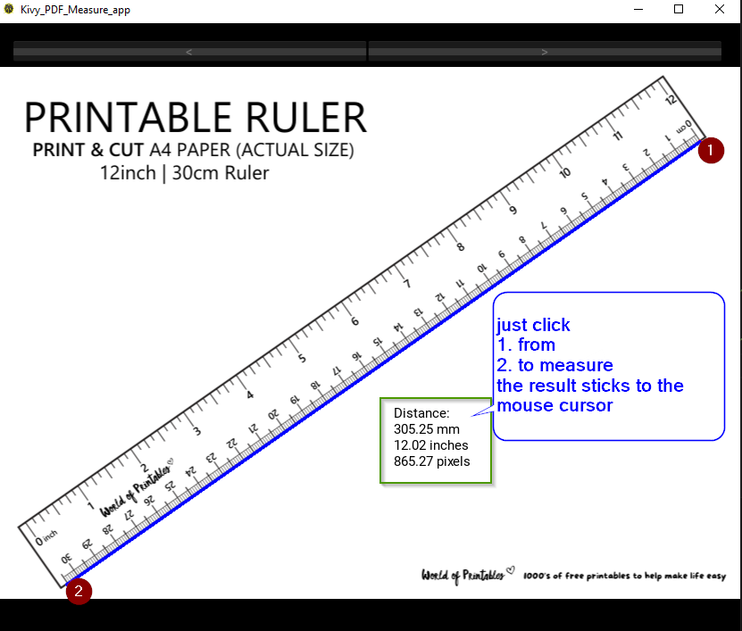
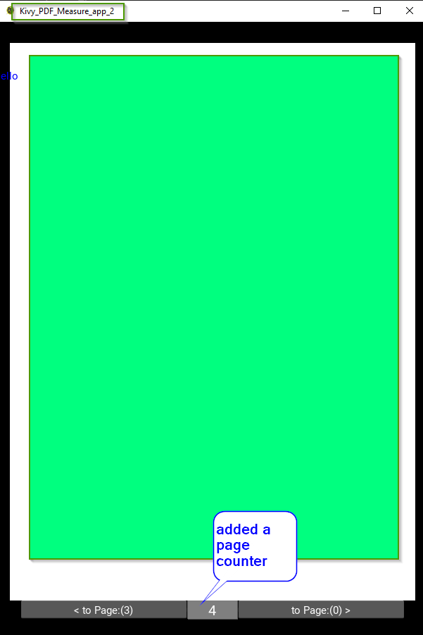

# kivy_measure_pdf
simple tool for measuring distances in pdf files.

just install the requirements from requirements.txt

and run Kivy_PDF_Measure_app.py
before running you need to put the path of your pdf file to the:

If you run it how it is it should show this:

added a page number label (also splitted the pdf code to PDF_Helper.py)
